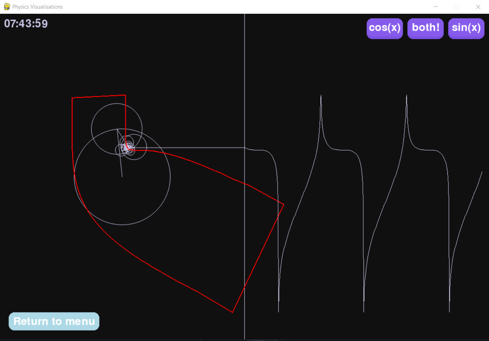
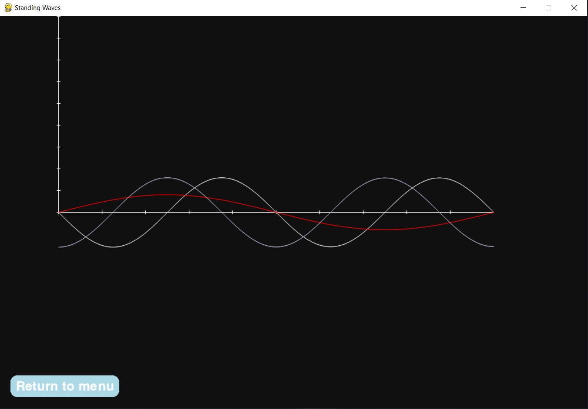

# Physics Visualisation App

<!-- @import "[TOC]" {cmd="toc" depthFrom=1 depthTo=6 orderedList=false} -->

<!-- code_chunk_output -->

- [Physics Visualisation App](#physics-visualisation-app)
  - [Showcase](#showcase)
  - [Features](#features)
    - [Fourier Series Visualisation](#fourier-series-visualisation)
    - [Standing Waves](#standing-waves)
  - [App Framework](#app-framework)
  - [Controls](#controls)
  - [Project Structure](#project-structure)
  - [Dependencies](#dependencies)

<!-- /code_chunk_output -->

This project provides an interface for launching multiple visualisations, currently including:

- **Fourier Series visualisation** 
- **Standing Waves on a string**

It is designed to just gain light intuiton on initially abstract ideas.

> This repository is a refactored and reorganised successor to two earlier personal projects.

---

## Showcase

<p align="center">
    
    
</p>

---

## Features

### Fourier Series Visualisation
- Real-time rotating-vector (epicycle) representation  
- Adjustable number of terms  
- Sine-only / cosine-only modes  
- Modular coefficient and frequency generation

---

### Standing Waves
- Classical standing-wave patterns for a string  
- Clean centered grid display  
- Visualisation of:
  - Nodes  
  - Antinodes  
  - Harmonic modes  

---

## App Framework
- Central main menu with submenu navigation  
- Simple architecture for adding additional visualisations  
- All simulations run inside the same top-level app structure  

---

## Controls

| Key | Action |
|-----|--------|
| **<kbd>UP</kbd><kbd>DOWN</kbd>** | Change Axes Scale (Standing Waves) |
| <kbd>**T**</kbd> | Show Fourier Trace |
| <kbd>**R**</kbd> | Reset Fourier Drawing Process |

---


## Project Structure
```
app/
│
├── app_main.py             # Overall entry
│
├── FourierSeries/
│ ├── main.py               # Fourier visualisation entry point
│ ├── testing.py            # Waveform series generation logic 
│ └── line.py               # Epicycle drawing and series reconstruction
│ 
└── StandingWaves/
  ├── main.py                 # Standing-wave entry
  ├── axes.py                 # Grid rendering
  ├── curve.py                # Wave plotting logic
  ├── button.py               # Local UI button helper
  └── standing_wave_functions.py

```
---

## Dependencies

- **Python 3.10+**  
- **pygame**  
- **numpy**  

(Standard libraries used: `os`, `math`, `time`, ...)
